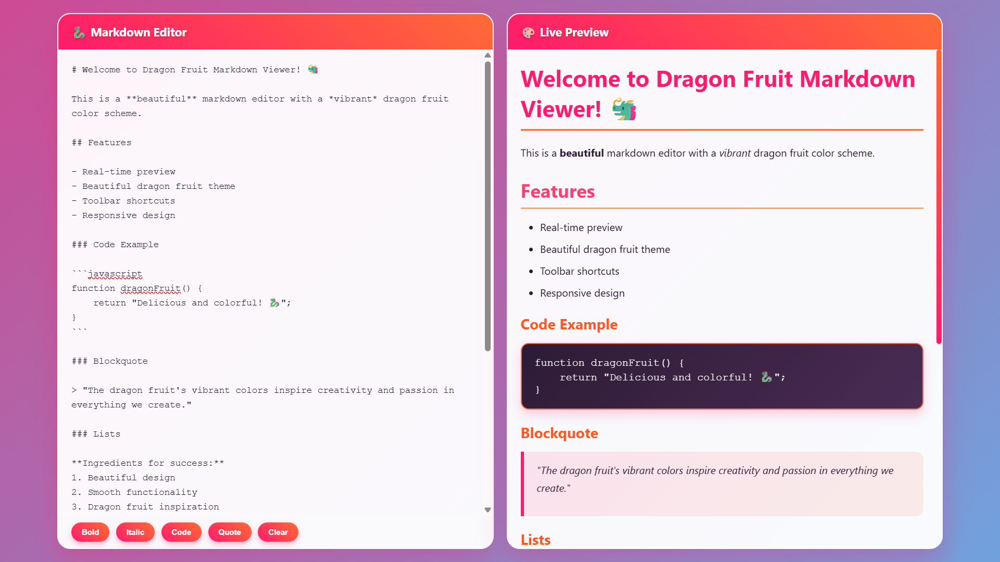

# 🐲 MarkDowner - Dragon Fruit Markdown Viewer

> *Where markdown meets the vibrant spirit of dragon fruit!* 🌺

A **deliciously beautiful** markdown editor that brings the exotic colors and energy of dragon fruit to your writing experience. Sweet, vibrant, and refreshingly smooth!

## ✨ What Makes It Juicy?

- 🎨 **Dragon Fruit Theme** - Gorgeous pink-to-orange gradients that dance across your screen
- ⚡ **Real-time Preview** - Watch your markdown transform instantly, like magic fruit
- 🛠️ **Quick Toolbar** - Bold, italic, code, and quote shortcuts at your fingertips
- 📱 **Responsive Design** - Looks stunning on any device, from phone to desktop
- 🌈 **Animated Background** - Mesmerizing gradient animation that keeps you inspired

## Screenshots


*Experience the vibrant dragon fruit colors while editing your markdown in real-time*

## 🚀 Getting Started

1. **Clone this tropical paradise:**
   ```bash
   git clone https://github.com/FalloutGhoulBusta/MarkDowner.git
   cd MarkDowner
   ```

2. **Open the fruit stand:**
   ```bash
   # Simply open index.html in your favorite browser
   open index.html
   ```

3. **Start creating!** 🎉
   - Type markdown in the left panel
   - Watch it bloom in the right panel
   - Enjoy the dragon fruit vibes!

## 🍃 Features That'll Make You Smile

- **Syntax Highlighting** - Code blocks that pop like dragon fruit seeds
- **Smooth Scrolling** - Synchronized scrolling between editor and preview
- **Beautiful Typography** - Every character looks as good as it tastes
- **Instant Feedback** - No waiting, just pure creative flow

## 🌟 Perfect For

- 📝 Writing documentation with style
- 📚 Creating beautiful README files (like this one!)
- ✍️ Drafting blog posts and articles
- 🎓 Taking notes that actually look good
- 🎨 Anyone who loves beautiful, functional tools

## 🎭 The Dragon Fruit Philosophy

*"Just like the dragon fruit - exotic on the outside, refreshingly simple on the inside, and absolutely delightful in every bite."*

This editor embodies the spirit of the dragon fruit: **bold**, **beautiful**, and **surprisingly sweet** to use.

---

**Made with 💖 and a lot of dragon fruit smoothies**

*Happy writing! May your markdown be as vibrant as a dragon fruit sunset.* 🌅✨
